# Knowledge Assistant


A Django REST Framework backend for an AI-powered **Knowledge Assistant** — combining retrieval-augmented generation (RAG) over your own documents, chat with an LLM, notes, auto-generated flashcards, and long-term memory, all behind a JWT-secured API.

## Table of Contents

- [Features](#features)
- [Architecture](#architecture)
- [Tech Stack](#tech-stack)
- [Installation](#installation)
- [Configuration](#configuration)
- [Usage](#usage)
- [Contributing](#contributing)
- [License](#license)

## Features

The project is organized as a set of focused Django apps:

| App          | Responsibility |
|--------------|---|
| `accounts` | User model, registration, and authentication |
| `chat` | Conversational endpoints — routes user messages to an LLM agent, with tool-calling support |
| `documents` | Document upload and storage, feeding the retrieval pipeline |
| `retrieval` | RAG pipeline — chunking, embedding, vector indexing, and semantic search over documents |
| `notes` | User-authored notes |
| `flashcards` | Automatic flashcard generation from indexed content |
| `memory` | Long-term memory storage for the assistant |
| `tasks` | Celery background jobs (indexing, flashcard generation, etc.) |
| `search` | Cross-source workspace search |
| `agents` | Agent/tool registry powering the chat assistant |
| `core` | Middleware and structured JSON logging, implemented in `core/middleware.py` and `core/logging.py` |

## Architecture

```mermaid
flowchart TD

subgraph group_runtime["Django Runtime"]

  node_urls{{"Root URL routing<br/>Django router<br/>[urls.py]"}}

  node_runtime{{"WSGI / ASGI entry<br/>deployment entry<br/>[asgi.py]"}}

  node_middleware["Middleware &amp; logging<br/>cross-cutting<br/>[middleware.py]"]

end

subgraph group_domains["Domain APIs"]

  node_accounts["Accounts API<br/>model-backed API<br/>[views.py]"]

  node_content["Documents &amp; notes API<br/>model-backed API<br/>[views.py]"]

  node_chat["Chat API &amp; records<br/>model-backed API<br/>[views.py]"]

  node_memory["Memory API<br/>model-backed API<br/>[views.py]"]

  node_flashcards["Flashcards API<br/>generated-content API<br/>[views.py]"]

  node_search["Cross-domain search<br/>search API<br/>[views.py]"]

end

subgraph group_ai["AI Orchestration"]

  node_agent_service["Agent execution service<br/>agent orchestrator<br/>[service.py]"]

  node_agent_registry["Agent registry<br/>agent catalog<br/>[registry.py]"]

  node_llm["LLM provider boundary<br/>provider abstraction<br/>[providers.py]"]

  node_tools["Agent tools<br/>tool integrations<br/>[retrieval_tool.py]"]

end

subgraph group_retrieval["Retrieval Pipeline"]

  node_ingestion["Load, extract &amp; split<br/>ingestion stages<br/>[loaders.py]"]

  node_indexing["Embedding &amp; index writer<br/>indexing service<br/>[indexing.py]"]

  node_vectorstore[("Vector store<br/>vector infrastructure<br/>[vectorstore.py]")]

  node_retriever["Query retriever<br/>grounding service<br/>[retriever.py]"]

end

subgraph group_async["Background Work"]

  node_celery["Celery workers<br/>async execution<br/>[celery.py]"]

  node_retrieval_tasks["Retrieval tasks<br/>background tasks<br/>[retrieval_tasks.py]"]

  node_flashcard_tasks["Flashcard generation tasks<br/>background tasks"]

end

node_database[("Relational database<br/>Django persistence")]

node_runtime -->|"serves HTTP"| node_urls

node_urls -->|"routes"| node_accounts

node_urls -->|"routes"| node_content

node_urls -->|"routes"| node_chat

node_urls -->|"routes"| node_memory

node_urls -->|"routes"| node_flashcards

node_urls -->|"routes"| node_search

node_middleware -.->|"cross-cuts requests"| node_urls

node_accounts -->|"persists"| node_database

node_content -->|"persists"| node_database

node_chat -->|"persists records"| node_database

node_memory -->|"persists"| node_database

node_flashcards -->|"persists sets"| node_database

node_chat -->|"executes agent"| node_agent_service

node_agent_service -->|"selects agent"| node_agent_registry

node_agent_service -->|"generates via"| node_llm

node_agent_service -->|"invokes optional tools"| node_tools

node_tools -->|"grounds with"| node_retriever

node_tools -->|"reads and writes"| node_memory

node_content -.->|"triggers indexing"| node_retrieval_tasks

node_retrieval_tasks -->|"queued on"| node_celery

node_celery -->|"runs ingestion"| node_ingestion

node_ingestion -->|"chunks content"| node_indexing

node_indexing -->|"writes vectors"| node_vectorstore

node_indexing -->|"stores index records"| node_database

node_retriever -->|"queries vectors"| node_vectorstore

node_search -->|"retrieves knowledge"| node_retriever

node_flashcards -.->|"requests generation"| node_flashcard_tasks

node_flashcard_tasks -->|"queued on"| node_celery

node_celery -.->|"runs generation"| node_llm

click node_urls "https://github.com/ashrayabashyal/knowledge_assistant/blob/main/config/urls.py"

click node_runtime "https://github.com/ashrayabashyal/knowledge_assistant/blob/main/config/asgi.py"

click node_middleware "https://github.com/ashrayabashyal/knowledge_assistant/blob/main/core/middleware.py"

click node_accounts "https://github.com/ashrayabashyal/knowledge_assistant/blob/main/accounts/views.py"

click node_content "https://github.com/ashrayabashyal/knowledge_assistant/blob/main/documents/views.py"

click node_chat "https://github.com/ashrayabashyal/knowledge_assistant/blob/main/chat/views.py"

click node_memory "https://github.com/ashrayabashyal/knowledge_assistant/blob/main/memory/views.py"

click node_flashcards "https://github.com/ashrayabashyal/knowledge_assistant/blob/main/flashcards/views.py"

click node_search "https://github.com/ashrayabashyal/knowledge_assistant/blob/main/search/views.py"

click node_agent_service "https://github.com/ashrayabashyal/knowledge_assistant/blob/main/agents/service.py"

click node_agent_registry "https://github.com/ashrayabashyal/knowledge_assistant/blob/main/agents/registry.py"

click node_llm "https://github.com/ashrayabashyal/knowledge_assistant/blob/main/llm/providers.py"

click node_tools "https://github.com/ashrayabashyal/knowledge_assistant/blob/main/tools/retrieval_tool.py"

click node_ingestion "https://github.com/ashrayabashyal/knowledge_assistant/blob/main/retrieval/loaders.py"

click node_indexing "https://github.com/ashrayabashyal/knowledge_assistant/blob/main/retrieval/indexing.py"

click node_vectorstore "https://github.com/ashrayabashyal/knowledge_assistant/blob/main/retrieval/vectorstore.py"

click node_retriever "https://github.com/ashrayabashyal/knowledge_assistant/blob/main/retrieval/retriever.py"

click node_celery "https://github.com/ashrayabashyal/knowledge_assistant/blob/main/config/celery.py"

click node_retrieval_tasks "https://github.com/ashrayabashyal/knowledge_assistant/blob/main/tasks/retrieval_tasks.py"

click node_flashcard_tasks "https://github.com/ashrayabashyal/knowledge_assistant/blob/main/tasks/flashcards_tasks.py"

classDef toneNeutral fill:#f8fafc,stroke:#334155,stroke-width:1.5px,color:#0f172a

classDef toneBlue fill:#dbeafe,stroke:#2563eb,stroke-width:1.5px,color:#172554

classDef toneAmber fill:#fef3c7,stroke:#d97706,stroke-width:1.5px,color:#78350f

classDef toneMint fill:#dcfce7,stroke:#16a34a,stroke-width:1.5px,color:#14532d

classDef toneRose fill:#ffe4e6,stroke:#e11d48,stroke-width:1.5px,color:#881337

classDef toneIndigo fill:#e0e7ff,stroke:#4f46e5,stroke-width:1.5px,color:#312e81

classDef toneTeal fill:#ccfbf1,stroke:#0f766e,stroke-width:1.5px,color:#134e4a

class node_urls,node_runtime,node_middleware toneBlue

class node_accounts,node_content,node_chat,node_memory,node_flashcards,node_search toneAmber

class node_agent_service,node_agent_registry,node_llm,node_tools toneMint

class node_ingestion,node_indexing,node_vectorstore,node_retriever toneRose

class node_celery,node_retrieval_tasks,node_flashcard_tasks toneIndigo

class node_database toneNeutral
```



## Tech Stack

- **Framework:** Django + Django REST Framework
- **Auth:** `djangorestframework-simplejwt` (JWT access/refresh tokens)
- **API docs:** `drf-spectacular` (OpenAPI schema)
- **LLM:** [Groq](https://groq.com/) via `langchain-groq` (default model: `llama-3.1-8b-instant`)
- **Vector store:** Chroma
- **Embeddings:** `sentence-transformers` (default: `all-MiniLM-L6-v2`)
- **Background tasks:** Celery, backed by Redis
- **CORS:** `django-cors-headers`

## Installation

### Prerequisites

- Python 3.10+
- Redis (for Celery broker/result backend)
- A PostgreSQL (or other `DATABASE_URL`-compatible) database
- A [Groq API key](https://console.groq.com/) for LLM access

### Steps

```bash
# 1. Clone the repository
git clone https://github.com/AshrayaBashyal/knowledge_assistant.git
cd knowledge_assistant

# 2. Create and activate a virtual environment
python -m venv venv
source venv/bin/activate   # Windows: venv\Scripts\activate

# 3. Install dependencies
pip install -r requirements.txt

# 4. Configure environment variables
cp .env.example .env   # .env.example is included in the repo — see Configuration below
# then edit .env with your own values

# 5. Apply database migrations
python manage.py migrate

# 6. Run the development server
python manage.py runserver
```

### Running background workers

Flashcard generation and document indexing run as Celery tasks and require a worker process alongside the server:

```bash
celery -A config worker --loglevel=info
```

Make sure Redis is running and reachable at the URL configured in `CELERY_REDIS_URL`.

## Configuration

All configuration is read from environment variables (see `config/settings.py`). A `.env.example` file is included in the repo — copy it to `.env` in the project root and fill in your own values:

| Variable | Default | Description |
|---|---|---|
| `SECRET_KEY` | `insecure-dev-key` | Django secret key — set a strong value in production |
| `DEBUG` | `True` | Django debug mode |
| `ALLOWED_HOSTS` | `localhost,127.0.0.1` | Comma-separated allowed hosts |
| `DATABASE_URL` | — | Database connection string (e.g. Postgres URL) |
| `CORS_ALLOWED_ORIGINS` | `http://localhost:8501` | Comma-separated origins allowed to call the API |
| `GROQ_API_KEY` | — | API key for the Groq LLM provider |
| `GROQ_MODEL` | `llama-3.1-8b-instant` | Groq model used for chat |
| `GROQ_TEMPERATURE` | `0.7` | Sampling temperature for the chat model |
| `CHROMA_PERSIST_DIR` | `<project>/chroma_data` | Directory for the Chroma vector store |
| `RETRIEVAL_TOP_K` | `4` | Number of chunks retrieved per query |
| `EMBEDDING_MODEL` | `sentence-transformers/all-MiniLM-L6-v2` | Embedding model for indexing/retrieval |
| `CHUNK_SIZE` | `1000` | Document chunk size (characters) for indexing |
| `CHUNK_OVERLAP` | `200` | Overlap between consecutive chunks |
| `RESULTS_PER_SOURCE` | `10` | Max results per source for workspace search |
| `CELERY_REDIS_URL` | `redis://localhost:6379/0` | Redis URL used as both Celery broker and result backend |
| `CHAT_HISTORY_MAX_MESSAGES` | `20` | Max past chat messages replayed to the model per turn |
| `DOCUMENT_MAX_UPLOAD_SIZE_MB` | `60` | Max allowed upload size for documents |
| `LOG_LEVEL` | `INFO` | Root logging level |

## Usage

The API is documented via `drf-spectacular` — once the server is running, the OpenAPI schema is available through the configured docs route.

### 1. Authenticate

Obtain a JWT access/refresh token pair:

```bash
curl -X POST http://localhost:8000/api/accounts/token/ \
  -H "Content-Type: application/json" \
  -d '{"username": "your-username", "password": "your-password"}'
```

Include the access token on subsequent requests:

```bash
curl http://localhost:8000/api/documents/ \
  -H "Authorization: Bearer <access_token>"
```

### 2. Upload a document

```bash
curl -X POST http://localhost:8000/api/documents/ \
  -H "Authorization: Bearer <access_token>" \
  -F "file=@/path/to/your/file.pdf"
```

Uploaded documents are chunked, embedded, and indexed into Chroma automatically via a background task.

### 3. Chat with the assistant

```bash
curl -X POST http://localhost:8000/api/chat/ \
  -H "Authorization: Bearer <access_token>" \
  -H "Content-Type: application/json" \
  -d '{"message": "Summarize the key points from the document I just uploaded."}'
```

The chat agent draws on indexed documents (retrieval), stored notes, and long-term memory to answer.

### 4. Generate flashcards

```bash
curl -X POST http://localhost:8000/api/flashcards/ \
  -H "Authorization: Bearer <access_token>" \
  -H "Content-Type: application/json" \
  -d '{"document_id": "<document-id>"}'
```

Flashcard sets are generated asynchronously — poll the returned set's status until it completes.

> Exact route prefixes depend on `api/urls.py` and each app's `urls.py` — check those for the authoritative path list.

## Contributing

Contributions are welcome. To propose a change:

1. **Fork** the repository and create a feature branch off `main`:
   ```bash
   git checkout -b feature/short-description
   ```
2. **Follow existing conventions** — keep app boundaries intact (models/serializers/views per app), and match the structured logging and middleware patterns already implemented in `core/logging.py` and `core/middleware.py`.
3. **Write clear commits** — imperative, present-tense subject lines (e.g. `Add flashcard retry endpoint`), with a short body explaining *why* when the change isn't self-evident.
4. **Test before opening a PR** — run migrations and the local server to confirm nothing's broken:
   ```bash
   python manage.py migrate --check
   python manage.py test
   ```
5. **Open a pull request** against `main` with a description of the change, its motivation, and any manual testing performed. Link related issues where relevant.
6. Be responsive to review feedback — small, focused PRs are easiest to review and merge quickly.

If you're planning a larger change (new app, schema change, provider swap), open an issue first to discuss the approach.

## License

This project is licensed under the [MIT License](https://choosealicense.com/licenses/mit/) — see the [LICENSE](LICENSE) file in the repository root for the full text.
